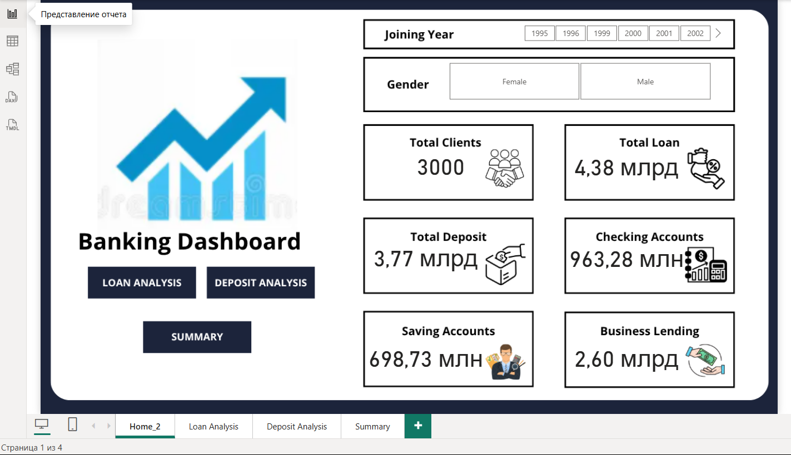
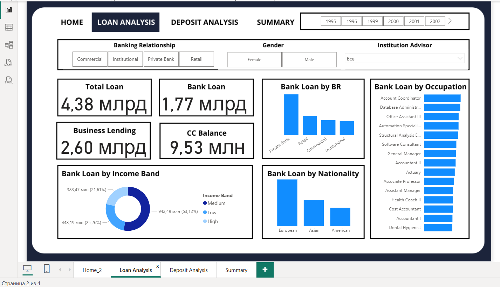
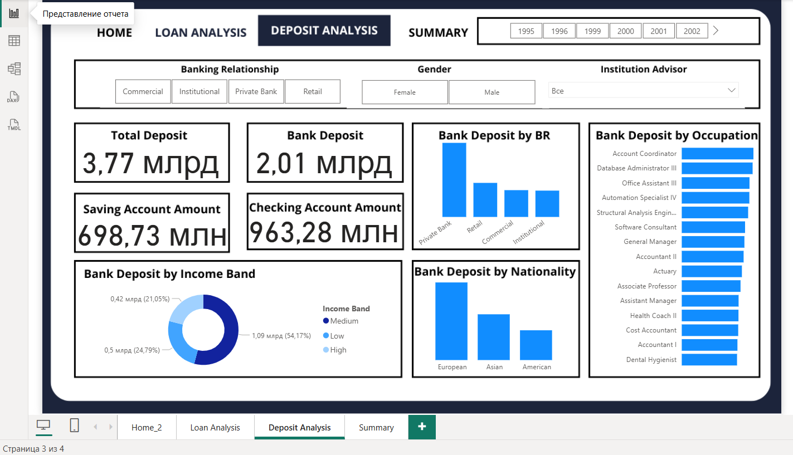
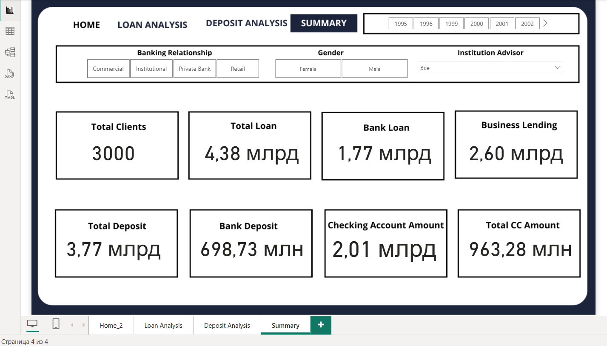

# Bank Customer Data Analysis

## Описание проекта
Этот проект посвящен комплексному анализу данных клиентов банка (выборка из 3000 записей). Проект демонстрирует сквозной цикл работы с данными — от развертывания реляционной базы данных до проведения разведочного анализа (EDA) и построения интерактивного BI-отчета для поддержки принятия бизнес-решений.

## Архитектура и пайплайн данных
Работа над проектом выстроена в рамках классического ETL/аналитического процесса:
1. **Хранилище данных (SQL):** На основе исходных данных развернута база данных в MySQL (скрипт `init_db.sql`), обеспечивающая надежное хранение информации о клиентах.
2. **Разведочный анализ и подготовка (Python):** С помощью Python реализовано прямое подключение к базе данных MySQL. В Jupyter-ноутбуке (`banking_analysis.ipynb`) проведен разведочный анализ данных (EDA), очистка, обработка пропусков и стандартизация значений. Также на этом этапе реализована инженерия признаков (Feature Engineering) — расчет нового категориального признака `Income Band` на основе расчетного дохода клиентов.
3. **Визуализация и бизнес-анализ (Power BI):** Аналитический отчет Power BI подключен непосредственно к подготовленной базе данных. На основе этих данных разработан интерактивный многостраничный дашборд.

## Что внутри репозитория
* `init_db.sql` — SQL-скрипт для инициализации структуры базы данных и импорта первичных данных.
* `banking_analysis.ipynb` — Jupyter Notebook с кодом подключения к БД, очисткой данных и EDA.
* `banking_retail_dashboard.pbix` — интерактивный дашборд Power BI.
* `Banking.xlsx` — исходный датасет в формате Excel.

## Интерактивность и навигация дашборда
Дашборд спроектирован с упором на удобный пользовательский опыт (UX) и включает в себя:
* **Сквозная синхронизация фильтров:** Настроенные срезы (Slicers) по годам, полу, категориям клиентов и инвестиционным консультантам полностью синхронизированы между всеми вкладками. Пользователь настраивает фильтр один раз и бесшовно переключается между разрезами аналитики.
* **Эргономичный интерфейс:** Реализовано удобное боковое меню для быстрой и интуитивной навигации.

## Структура Дашборда
1.  **Home**: Обзорная страница с главными KPI:
    * Total Clients: 3000
    * Total Loan: 4.38 млрд
    * Total Deposit: 3.77 млрд
2.  **Loan Analysis**: Детальный разбор кредитного портфеля. Включает анализ выдачи займов (`Bank Loan by BR`, `Bank Loan by Income Band`), бизнес-кредитования (`Business Lending`) и балансов по кредитным картам.
3.  **Deposit Analysis**: Анализ привлеченных средств. Охватывает общие депозиты, а также распределение по сберегательным (`Saving Account`) и расчетным (`Checking Account`) счетам в разрезе демографии и профессий.
4.  **Summary**: Сводная панель, объединяющая все ключевые финансовые метрики на одном экране для быстрого мониторинга.

## Ключевые метрики и признаки
* `BRId` — исходный признак из датасета, определяющий категорию клиента (Retail, Business, Private).
* `Income Band` — расчетный уровень дохода клиента (Low, Medium, High), сформированный программно в ходе обработки данных на Python.
* Финансовые показатели (депозиты, кредиты, балансы) — агрегированы в миллионах и миллиардах.

## Стек технологий
* **СУБД:** MySQL
* **Язык обработки данных:** Python (`pandas`, `matplotlib`, коннекторы к БД)
* **BI-аналитика:** Power BI

## 📊 Визуализация дашборда (Power BI)

Ниже представлены ключевые страницы дашборда, разработанного в Power BI для анализа банковских данных:

1. **Home Page** 
2. **Loan Analysis** 
3. **Deposit Analysis** 
4. **Summary** 

   ### 📊 Выводы и ценность проекта
Данный дашборд позволяет банку оперативно отслеживать состояние клиентского портфеля и принимать обоснованные управленческие решения:

*   Мониторинг KPI: Управленцы получают быстрый доступ к ключевым финансовым показателям (Total Clients, Loan, Deposit), что позволяет оценить масштаб и динамику бизнеса в режиме реального времени.
*   Сегментация клиентов: Анализ по категориям (BRiD) и уровню дохода (Income Band) помогает выявлять наиболее прибыльные группы клиентов для формирования целевых предложений.
*   Управление кредитным риском: Детализация по типам кредитования (Business Lending, CC Balance) дает возможность отслеживать структуру задолженности и вовремя реагировать на изменения в портфеле.
*   Эффективность анализа: Благодаря интерактивным срезам и синхронизации фильтров, процесс исследования данных становится прозрачным и быстрым, минимизируя время на поиск ответов на бизнес-вопросы.
